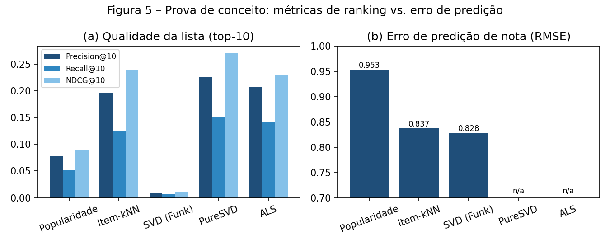

# Projeto Aplicado III – Sistema de Recomendação de Livros

**Universidade Presbiteriana Mackenzie – Curso de Ciência de Dados**
**Aluno:** Enzo Enrico Braga Cavalcante (RA 10744145)
**Local/Ano:** Guarulhos – 2026

## Sobre o projeto

Desenvolvimento e avaliação de um **sistema de recomendação de livros baseado em filtragem colaborativa**, capaz de gerar listas personalizadas a partir do histórico de avaliações dos usuários. O projeto tem caráter extensionista: o código é disponibilizado de forma aberta e documentada para que possa ser adaptado por bibliotecas públicas, escolares e comunitárias como ferramenta de apoio ao incentivo à leitura (ODS 4, 9 e 10).

Continuação do [Projeto Aplicado II](https://github.com/Enzo-Enrico/Projeto-Aplicado-II-Analise-Sentimento) (análise de sentimento em avaliações de filmes e séries).

## Dataset

[goodbooks-10k](https://github.com/zygmuntz/goodbooks-10k) (Zajac, 2017): 5.976.479 avaliações (1–5) de 53.424 usuários sobre 10.000 livros, mais metadados (`books.csv`), marcações "quero ler" (`to_read.csv`) e tags da comunidade. Esparsidade de 98,9%; 20% dos livros concentram 67,5% das avaliações.

## Modelos e avaliação

Filtragem colaborativa em duas famílias: **vizinhança item-item (k-NN)** e **fatoração de matrizes** (SVD com vieses, PureSVD, ALS implícito), comparadas contra baselines de média e popularidade.

A avaliação separa explicitamente:
- **erro de predição de nota** – RMSE e MAE;
- **qualidade da lista recomendada** (critério central) – Precision@10, Recall@10, NDCG@10, com ranking exaustivo sobre todos os itens não vistos e holdout de 20% por usuário.

### Resultados da prova de conceito (Etapa 2, hiperparâmetros padrão)

| Modelo | RMSE | MAE | P@10 | R@10 | NDCG@10 |
|---|---|---|---|---|---|
| Média global | 0,991 | 0,774 | – | – | – |
| Média do item / Popularidade | 0,953 | 0,763 | 0,078 | 0,052 | 0,089 |
| Item-kNN (cosseno, k=50) | 0,837 | 0,614 | 0,197 | 0,126 | 0,240 |
| SVD com vieses (50 fatores) | **0,828** | 0,640 | 0,009 | 0,007 | 0,010 |
| PureSVD (50 fatores) | – | – | **0,226** | **0,150** | **0,270** |
| ALS implícito (64 fatores) | – | – | 0,208 | 0,141 | 0,230 |

Achado principal: o modelo com menor RMSE (SVD) gera a pior lista, e os melhores modelos de ranking não preveem nota alguma — reproduzindo Cremonesi, Koren e Turrin (2010). A escolha do modelo final será feita pelas métricas de ranking.



## Estrutura do repositório

```
├── data/          # download.py baixa o goodbooks-10k (CSVs ignorados pelo git)
├── src/           # 01_eda.py (análise exploratória) e 02_poc_modelos.py (modelos + avaliação)
├── figures/       # figuras geradas pela EDA e pela prova de conceito
├── docs/          # relatórios das etapas e resultados (csv/json)
├── notebooks/     # experimentos exploratórios
├── requirements.txt
└── README.md
```

## Como executar

```bash
git clone https://github.com/Enzo-Enrico/Projeto-Aplicado-III-Sistema-Recomendacao.git
cd Projeto-Aplicado-III-Sistema-Recomendacao
pip install -r requirements.txt
python data/download.py
cd src
python 01_eda.py
python 02_poc_modelos.py
```

A prova de conceito completa roda em cerca de 3 minutos em uma máquina com 4 GB de RAM.

## Cronograma

| Etapa | Atividades | Período | Status |
|---|---|---|---|
| 1 | Tema, grupo, repositório, Capa, Sumário e Introdução | Set/2026 | ✅ |
| 2 | Bibliotecas, EDA, tratamento, modelo inicial (POC), forma de avaliação, Referencial Teórico | Set–Out/2026 | ✅ |
| 3 | Ajuste de hiperparâmetros, avaliação experimental completa, Metodologia e Resultados | Out–Nov/2026 | ⏳ |
| 4 | Protótipo, guia de implantação, Resumo, Conclusão, relatório e apresentação final | Nov–Dez/2026 | ⏳ |

## Entregas

- [Etapa 1 – Capa, Sumário e Introdução](docs/Projeto_Aplicado_III_Etapa1.pdf)
- [Etapa 2 – Introdução e Referencial Teórico](docs/Projeto_Aplicado_III_Etapa2.pdf)
- [Etapa 3 – Relatório da Prova de Conceito](docs/Projeto_Aplicado_III_Etapa2_Prova_de_Conceito.pdf)
